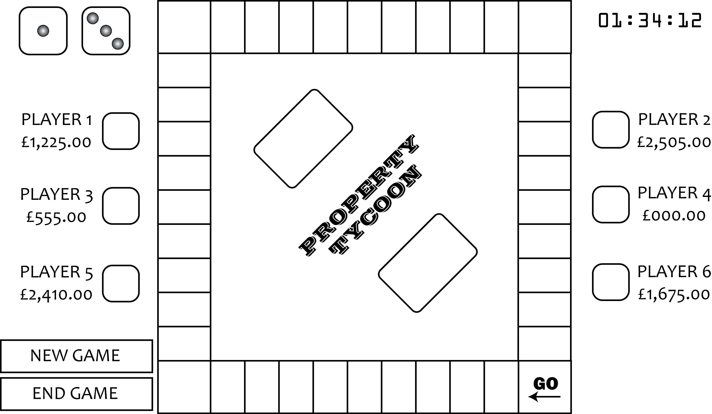

# Sprint 1

## Summary Data

| Summary Data          |            |
| --------------------- | ---------- |
| Team number           | 16         |
| Sprint technical lead | Philip     |
| Sprint start date     | 11-02-2020 |
| Sprint end date       | 18-02-2020 |

## key contributions

Individual key contributions

| Person   | Area             |
| :------- | ---------------- |
| Lee      | GUI and borad    |
| Philip   | GameModel        |
| Roksanna | GUI, Tokenfigure |
| Tom      | JasonReader      |

## User stories

After this sprint, we should have the game's GUI show a the bord, dices and a token.
The squares in the bord will show their names,
which can be modified by changing inside a JSON file.
The change will affect when restarted the app.
Player can throw dices and token will move around the bord.

## Requirements analysis

Function requriment (fun-req)

1. A Dice value can be 1-6 and have a discrete uniform distribution.
2. User can see current dices values as numbers or dots.
3. Dice can be throen by clicking on one of the dices.
4. Clik on dice, new values and token move the number step as the dice shows.
5. Token can move around the board.
6. Token move clockwise around the board.
7. Each square should have a name.
8. The square names should be able to change by a JSON file.
9. The effect of changing the JSON file will be sen after APP restart.

Non-functionle (nfun-reg)

1. Using Java to acheive requriment of work on both Windos and Mac.
2. Uisng JavaFX as GUI component

## Design

Design in dividade in tre main parts:

- GUI : Handle the interface and view given to player
- Game model : Has all game logic
- IO : Hide file format for rest of the app

Figure below will be the template for the GUI. This case the template, so the developer can change for there liking.
As we don't know how much about JavaFX, the class diagram of controllers is light on details compare to main modele in class diagram.

The class structure expected after the sprint is shown in figure below.
Where all classes in game level shoud be direct from game domain.

## Test plan and evidence of testing

Testing GUI will be by running the program and go through
the requirements list in this document.

Dice and player will their behaviour tested by unit tests.
For Dice, fun-req 2 will directly tested.
Requirements 5 will be test by Player class tests.
Player class will use most of Squares class method,
so Player class tests cover squares.
The rest of requirement tested by hand.

As the Sprint non-automated tests are small, the sprint summary will be the test protocol.

## Summary of sprint

Thies sprint fail reache taget of the sprint.
As GUI was implemennt moving logic by it self, insted of using game model with exists.
Fisule testing can the only show the GUI conecpt.

The team feelt that a one week sprint is to short to achive anything.
We will in the future use two week sprints.
